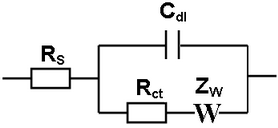
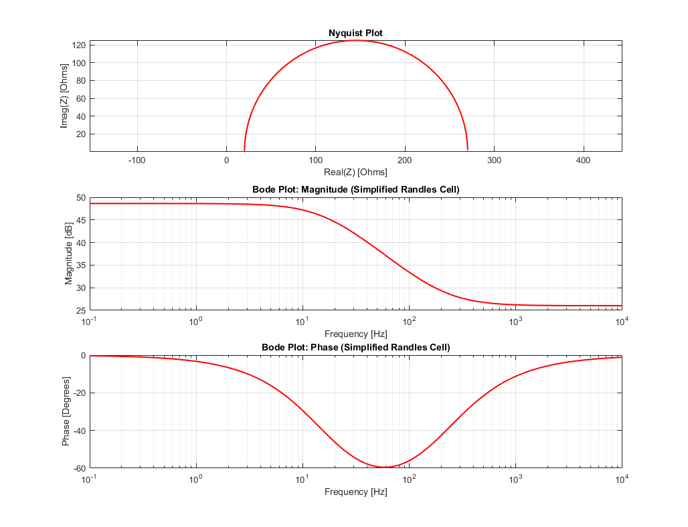
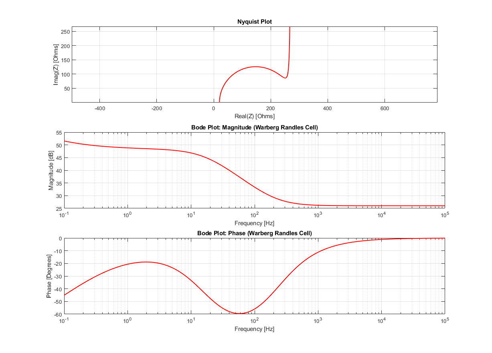

# Electrochemical Impedance Fitting Embedded  

**Estimation of EIS Parameters using Randle Cell Model with Warburg, and Embedded C Implementation on ESP32.**    

## Table of Contents  
- [Aim](#aim)  
- [Description](#description)  
- [Cell Model / Equivalent Impedance Circuit](#cell-model--equivalent-impedance-circuit)  
- [Modelled Parameters and Physical Interpretation](#modelled-parameters-and-physical-interpretation)  
- [Matlab Impedance Simulation](#matlab-simulation)  
- [Cell Parameter Estimation](#cell-parameter-estimation)  
- [Embedded Platform Implementation](#embedded-platform-implementation)  
- [Practical Consideration for optimization : Important ](#Practical-Considerations-for-Nelder-Mead)  
- [Acknowledgments](#Acknowledgments)  

---  

## Aim  
This project uses Electrochemical Impedance Spectroscopy (EIS) with the Randles Cell Model (including Warburg impedance) to estimate cell parameters through Least Squares Estimation. The goal is to identify circuit components affecting impedance, aiding in the assessment of cell aging and degradation.  
The estimation process is implemented on an ESP32 microcontroller. By performing real-time optimization on the edge, the system provides efficient, on-site monitoring of cell health and performance without the need for external computation. The embedded results are compared with simulated data to evaluate accuracy and performance.  

---  

## Description  
We simulate Electrochemical Impedance Spectroscopy (EIS) for a cell using the **Randles Cell Model** 
Cell parameter estimation is performed using **Least Squares Estimation** in MATLAB to estimate the cell parameters from simulated impedance measurements. Here we are blind to the parameters of the model but have the model structure and impedance measurements. Starting with an initial guess, we must estimate the true parameters.
The same cell model parameter estimation is replicated on an embedded platform (Arduino ESP32) using the **Nelder-Mead Method** of Least Squares. The results are matched, and the performance is measured/timed.  
We also explore practical considerations of implementing Nelder-Mead, and data representation.  

## Cell model / equivalent impedance circuit  
Reference : https://upload.wikimedia.org/wikipedia/commons/thumb/9/93/Randles_circuit.png/220px-Randles_circuit.png  
  

The Warburg infinite impedance (Zw) is given by the equation:  

$$
Z_W = \sigma \omega^{-1/2} (1 - j)
$$

Where:
- Sigma is the Warburg coefficient.
- Omega/w is the angular frequency, \( \omega = 2 \pi f \).

Real life simulation uses Warburg finite impedance and depends on the geommetry of the cell and other factors. For our purposes, the infinite model is enough as we are not aiming to create a very accurate model, but rather focus on estimating the parameters of the model we choose, and the optimization itself.  

## Modelled Parameters and Physical Interpretation  

| **Parameter**        | **Physical Interpretation**                                                                                                                                                  | **Increase in Parameter**                                                                                               | **Decrease in Parameter**                                                                                              |  
|----------------------|--------------------------------------------------------------------------------------------------------------------------------------------------------------------------------|------------------------------------------------------------------------------------------------------------------------|------------------------------------------------------------------------------------------------------------------------|  
| **Rs (Solution Resistance)** | Resistance of the electrolyte between the electrodes.                                                                                                                   | - Low temperature (reduces ionic mobility).- Electrolyte leakage (reduces ionic path).- Contamination or electrolyte depletion (reduces ionic concentration). | - Higher temperature (increases ionic mobility).- Improved electrolyte composition (more conductive).               |  
| **Rp/Rct (Polarization Resistance)** | Resistance at the electrode-electrolyte interface, linked to charge transfer resistance.                                                                           | - Surface passivation (formation of insulating layers).- Reduced catalyst activity (slower electrochemical reactions).- Electrochemical degradation (corrosion or fouling of electrodes). | - Improved electrode surface (more active material).- Higher temperature (increased reaction rates).               |  
| **Cdl (Double Layer Capacitance)** | Capacitance of the electrochemical double layer at the electrode-electrolyte interface.                                                                           | - Larger electrode surface area (more active sites).- Higher dielectric constant in electrolyte (improves charge storage). | - Electrode surface degradation (loss of active sites).- Lower dielectric constant in electrolyte (reduced charge storage). |  
| **Zw (Warburg Coefficient)** | Diffusion impedance, indicating how ion diffusion affects impedance.                                                                                                  | - Poor ion diffusion (thicker diffusion layers, lower temperature, or high-viscosity electrolytes).- Electrode blockage (byproducts hindering diffusion). | - Improved ion mobility (better electrolyte composition, higher temperature).- Thinner diffusion layer (optimized stirring or electrode design). |  


## Matlab Simulation  
We simulate impedance values referencing cell parameter using a simple Randles model ( No Warburg ), and then including Warburg impedance. We will later use the simulated impedance results to back estimate the true parameters given below  

Rs = 20 ohm  
Rp = 250 ohm  
Cdl = 40 uF / 40e-6 Farad  
sigma = 150 ( Warburg coeff.)  

I have tried to match result in reference : https://www.gamry.com/application-notes/EIS/basics-of-electrochemical-impedance-spectroscopy/  
We plot real vs complex impedance , and bode plot of magnitude and phase components of impedance vs freqency. The Warburg model does not match up exactly as the reference, but that is fine at this point in time.  

### Simplified model  
[RANDLES SIMPLE CODE MATLAB](randles_simplified_model.m)  
  

### Randles with Warberg  
[WARBERG ADDED CODE MATLAB](randles_with_warberg.m)  
  


## Cell parameter estimation  
- We define true values for the model parameters: Rs (Solution Resistance), Rp (Polarization Resistance), Cdl (Double Layer Capacitance), and sigma (Warburg Coefficient).  
- We simulate Electrochemical Impedance Spectroscopy (EIS) data using the Randle Cell model with Warburg impedance. We measure complex impedance over a freqeuncy sweep from 0.1 to 10khz AC (10 measurements logspace spread).  
- Generate noisy simulated impedance data for fitting. This is done on purpose, measurements arent ever perfect.  
- Use Least Squares Fitting to estimate the model parameters by minimizing the difference between noisy data and model predictions. We start with an initial guess. The aim is to iteratively improve on the initial guess until we reach close to the true values.  
- The estimation process adjusts the parameters to best match the simulated data.  
- We obtain estimated values for Rs, Rp, Cdl, and sigma after optimization.  

We tried 2 different algorithms/methods in MATLAB. The embedded C implementation follows from the NelderMead method.  

[lsqnonlin method MATLAB](lss_estimation_lsqnonlin.m)  

```
Estimated Parameters:  
Rs: 19.928  
Rp: 248.421  
Cdl: 3.9958e-05  
Sigma: 151.7565  
```

[NelderMead method MATLAB](lss_estimation_NelderMead.m)  

```
Estimated Parameters:  
Rs: 21.7962  
Rp: 270.9082  
Cdl: 4.0415e-05  
Sigma: 147.6066  
```

There will be run to run variance due to artificially added noise.

## Embedded platform implementation  

We implement Least Squares Estimation on the ESP32 using the Nelder-Mead optimization method for cell parameter estimation. It follows the same flow as the process above.

[Cell parameter estimation ESP32](randles_embedded/randles_embedded.ino)  
The optimized parameters are outputted along with the time taken for the process.  
Note : Stack/resoucre usage is still not optimized in any way and the time taken is an approximate measure.  
Note: The Code automatically accepts capacitance to be in uF. This is done so that the order magnitude of all the variables input to the NelderMead optimizer are similar.  

```
12:42:02.671 -> Optimization task created!  
12:42:02.752 -> Estimated Parameters:  
12:42:02.752 -> Param 0: 19.84  
12:42:02.752 -> Param 1: 251.20  
12:42:02.752 -> Param 2: 40.19 ->> This is the capacitance in uF , more info on this in practical considerations.  
12:42:02.752 -> Param 3: 149.16  
12:42:02.752 -> Nelder-Mead optimization took: 41 milliseconds  
```
The ESP32 takes 41 milliseconds to run the optimization and estimate parameters. 
I have had to allocate 16k stack to the task, which is a lot.( That is something to look into )

## Practical Considerations for Nelder-Mead  

### Data Magnitude Challenge in Optimization  
When the code and optimization from MATLAB was blindy replicated into Embedded C, I faced problems. The result would be completely wrong or the program would get stuck somewhere (yet to be investigated).  
If we look at this code section for the creation of the starting simplex for NelderMead  

```
// Perform the Nelder-Mead optimization  
void nelderMeadOptimization(float *start, int n, int max_iter, float tol) {  
    const float alpha = 1.0;    // Reflection coefficient  
    const float gamma = 2.0;    // Expansion coefficient  
    const float rho = 0.5;      // Contraction coefficient  
    const float sigma = 0.5;    // Shrink coefficient  

    float simplex[n+1][n];  
    float f_values[n+1];  

    // Initialize simplex points and their function values  
    for (int i = 0; i <= n; i++) {  
        for (int j = 0; j < n; j++) {  
            simplex[i][j] = start[j];  
        }  
        if (i > 0) {  
            simplex[i][i-1] = start[i-1] * 1.05; // Perturbation to form the simplex  
        }  
        f_values[i] = objectiveFunction(simplex[i]);  
    }  
    ....... remaining optimization code  
```

We see that given N parameters (from the inital guess), we create N+1 points in an N dimensional space. A 5% pertubation (value * 1.05 ) is applied to each point to create diversity in the cost/objective function.  
For example, let's say that our inital Guess is 1,1,1,1  
The points in the simplex will be as follows :  
```
1.00,1.00,1.00,1.00  
1.05,1.00,1.00,1.00  
1.00,1.05,1.00,1.00  
1.00,1.00,1.05,1.00  
1.00,1.00,1.00,1.05  
```

When the inital guesses have numerical values in a similar order of magnitude, the reflect,extend,contract,shrink operations occur effectively.  
But if one parameter in our starting guess is really small like 20e-6 , which is our inital capacitance guess. This causes the algorithm's geometric operations (reflection, expansion, contraction, shrink) to be ineffective.  
The simplex may not explore the search space effectively and the Optimization steps may lead to poor convergence or incorrect estimates.  

#### Solution  
Therefore, to make the parameter magnitudes similar in scale, we moved the uF scaling to the impedance calculation, so the results are unchanged, but the geometric operations are carried out better.  

### Parameter diversity in Objective Function  

It is crucial that each of the parameters being optimised for uniquely affect the cost function.   
For example let's say that we have 2 resistances in series 3 ohm and 7 ohm, total is 10ohm.  
If our intial guess was 5 ohm and 5 ohm, we reach the desired 10 ohm total, but don't converge to the actual true parameters.  

In our cell model each parameter Rs,Rp,Cdl,and Zw combined are able to produce sufficiently unique changes in the objective/cost function, and therefore can be estimated effectively.  
Including a frequency sweep and analyzing both real and complex values of impedance over the sweep for the residual greatly aids this.  

Rs: Dominates the high-frequency real part of impedance.  
Rp: Affects both real and imaginary parts at mid-range frequencies.  
Cdl: Impacts the low-frequency imaginary part.  
sigma/Zw: Influences impedance over a range of frequencies due to ion diffusion effects.  

```
// Objective function to minimize  
float objectiveFunction(float *params) {  
    float Rs = params[0];  
    float Rp = params[1];  
    float Cdl = params[2];  
    float sigma = params[3];  
      
    Complex Z_model[num_points];  
    calculateImpedance(Rs, Rp, Cdl, sigma, Z_model);  

    float residual = 0.0;  
    // Sweep over muliple frequencies for diversity  
    for (int i = 0; i < num_points; i++) {  
        float real_residual = Z_real_noisy[i] - Z_model[i].real();  
        float imag_residual = Z_imag_noisy[i] - Z_model[i].imag();  
        residual += real_residual * real_residual + imag_residual * imag_residual;  
    }  
    return residual;  
```


## Acknowledgments

This project leveraged AI-powered tools, such as ChatGPT for generation of bolilerplate code and documentation. The assistance provided was crucial in improving development time and implementation.  
AI Tools may guide and assist, but the resposibility of critical thinking and problem solving is ours.
